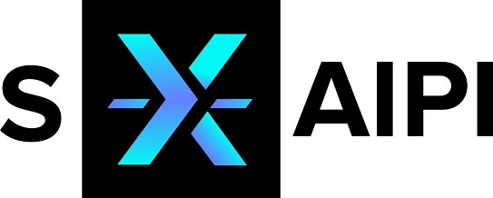

# Metadata Generator

Copyright (c) 2024 VDEh-Betriebsforschungsinstitut GmbH

Please see [LICENSE.txt](LICENSE.txt)!

---

This work has been supported by the project "self-X Artificial Intelligence for European Process Industry digital transformation" (s-X-AIPI), which has received funding from the European Union’s Horizon Europe research and innovation programme under grant agreement No. 101058715.

---

This piece of software generates metadata from production data to be exploited by artificial intelligence (AI) and rule engines.
