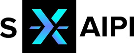

# Metadata Generator

Copyright (c) 2024 VDEh-Betriebsforschungsinstitut GmbH

License: MIT. Please see [LICENSE.txt](LICENSE.txt)!

---

This work has been supported by the project "self-X Artificial Intelligence for European Process Industry digital transformation" (s-X-AIPI), which has received funding from the European Union’s Horizon Europe research and innovation programme under grant agreement No. 101058715.

Project website: [https://s-x-aipi-project.eu/](https://s-x-aipi-project.eu/)

Website of the steel use case: [https://s-x-aipi-steel.github.io/](https://s-x-aipi-steel.github.io/)

---

## Information about software

This piece of software generates metadata from production data to be exploited by artificial intelligence (AI) and rule engines.
